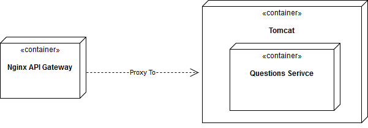

# Vessel Project

1. API Gateway
 - Url rewrite
 - HTTP headers (X-Forwarded-For, X-RequestId etc)
2. Reverse Proxy
3. Quartz scheduler
4. Hibernate 2nd level caching

## Setting up

- Install Docker
- Clone this repository
- Run below shell command

```bash
./build-all.sh
```

## Deployment




## Licensing
The MIT License (MIT). See [LICENSE](LICENSE) for full license text.
